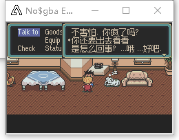
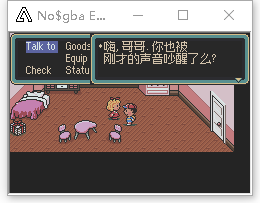

# Mother2Gba-chs
chinese localization project for the GBA game mother1+2 (mohter2 part only)

  

## Notice
　　This project is a modification of jeffman‘s english  [translation](https://github.com/jeffman/Mother2GbaTranslation) ,to create a chinese localized version of the game.This couldn't be done without thier great efforts.

## 进度

### 中文字体
　　`chs_font/makefont.py`用于生成字体，运行需要安装python3.8。读取 bdf 字体，并生成mother2所需的字库文件。

### 单字节、双字节
　　中文需要双字节编码，故在英文版基础上做如下修改。
　　
- `src/c/vwf.c`中`weld_entry`函数返回值表示单字节or双字节。
- `m2-vwf-entries.asm`中`c980c_weld_entry`读取返回值，R6寄存器表示脚本指针的增量，如果双字节则加一。
- 中文编码使用GB2132编码。编码第一个字节减去0xA1,第二个字节保持不变。英文符号从0x50开始，所以此编码方式覆盖GB2132中0xA1到0xF1的区，应该够用。

## 如何翻译
　　如果你想编辑翻译内容，只需要修改`working/m12-strings-chs.txt`，每个标签下分为三行，后两行用{}括起来的是英文原文和日文原文的参考，对程序无影响。文本包含大量的控制字符，这些控制字符必须保留。翻译时主要有影响的控制字符有：

- [01 FF] 换行。换行后，为了对齐文本，需要在新行前加两个空格符
- [02 FF] 换行加打印一个提示符。（文本最开始的小圆点）
- [1B FF XX XX] 文本停顿一段时间。

　　根据游戏内对话框的大小，大部分对话需要每10个汉字就换行。

## 如何构建中文rom

### 依赖项
- windows 7 or later
- [GNU Arm Embedded Toolchain](https://developer.arm.com/open-source/gnu-toolchain/gnu-rm/downloads) 安装时选择添加到PATH!
- 原版 MOTHER 1+2 ROM (SHA-1 `F27336B9...`)

1. 环境搭建
    1. 下载安装 GNU Arm Embedded Toolchain.  确认工具链的`bin` 文件夹在环境变量里（安装时勾选add to path 即可）.
    2. clone本项目代码到本地，将原本 MOTHER 1+2 ROM 复制到bin文件夹，并重命名为 `m12fresh.gba`.

2. 汉化文本
　　修改 `m12-strings-chs.txt`

3. 构建中文 ROM
    1. 双击运行 `build_string.bat`并等待完成.
    2. 双击运行 `build_hack_asm.bat`并等待完成.
    3. 正常情况下生成的中文ROM为 `bin/m12.gba`.

